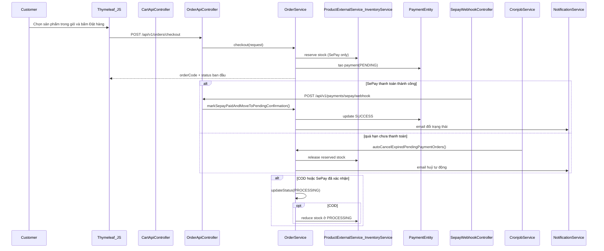

# Huy - Notes cho Chương 2/4/5

Tài liệu này tổng hợp phần của Huy: Cart -> Checkout (SePay/COD) -> Order Lifecycle.

## Chương 2 - Sequence Diagram luồng mua hàng/thanh toán

## Chương 4 - Đặc tả logic giao dịch và bảo mật thanh toán

### 1) Logic trạng thái đơn hàng
- `SEPAY`: `PENDING_PAYMENT -> PENDING_CONFIRMATION -> PROCESSING -> SHIPPING -> DELIVERED`.
- `COD`: `PENDING_CONFIRMATION -> PROCESSING -> SHIPPING -> DELIVERED`.
- Nhánh kết thúc phụ: `CANCELLED`, `RETURN_REFUND`.

### 2) Rule tồn kho đã khóa
- SePay reserve tồn khi tạo đơn ở `PENDING_PAYMENT`.
- Nếu timeout/hủy ở `PENDING_PAYMENT` thì release tồn.
- COD chỉ trừ tồn khi vào `PROCESSING`.
- Hủy từ `PROCESSING` (COD) thì hoàn tồn.

### 3) Rule hủy đơn của khách
- Chỉ được hủy ở `PENDING_PAYMENT`, `PENDING_CONFIRMATION`, `PROCESSING`.
- Hủy đơn lưu lý do và chuyển `CANCELLED` ngay.

### 4) Bảo mật webhook SePay
- Dùng API key cho endpoint webhook.
- Bản ghi `transaction_id` unique để chống xử lý trùng (idempotency).
- Trả kết quả `ignored` cho giao dịch trùng/thiếu tiền/sai trạng thái đơn.

## Chương 5 - Checklist kiểm thử phần Huy (rút gọn)

### Nhóm Cart/Checkout
- Merge local cart vào DB sau đăng nhập.
- Chỉ checkout item đã chọn.
- Validate `phone/email/address/paymentMethod`.
- Tạo đơn SePay vào `PENDING_PAYMENT`, COD vào `PENDING_CONFIRMATION`.

### Nhóm trạng thái đơn và tồn kho
- Cấm chuyển trạng thái sai thứ tự.
- Bắt buộc `trackingNumber` khi sang `SHIPPING`.
- `Đã nhận hàng` chuyển `SHIPPING -> DELIVERED`.
- Hủy đơn đúng các trạng thái cho phép.
- Kiểm tra trừ/hoàn tồn kho theo rule split-by-payment.

### Nhóm webhook/timeout/email
- Webhook duplicate transaction trả `ignored`.
- Webhook số tiền thiếu trả `ignored`.
- Webhook order không hợp lệ trả 400.
- Auto-cancel sau timeout SePay.
- Email log được gọi ở mọi lần đổi trạng thái.
