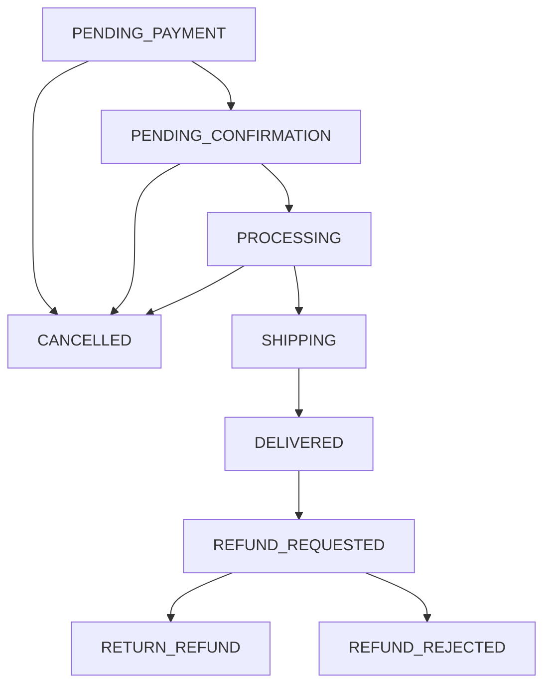

# Technical Design - Cart/Checkout/Order (Huy)

## 1. Architecture Overview

- **Frontend**: Thymeleaf templates + vanilla JS + Tailwind.
- **Backend**: Spring Boot REST + Service layer + JPA.
- **DB**: MySQL.
- **Storage**: local filesystem `/uploads` cho ảnh refund.
- **Async/Automation**:
  - Scheduler auto-cancel SePay timeout.
  - Notification service gửi email/log trạng thái.

## 2. Core Components

- `CartApiController` + `CartService`
- `OrderApiController` + `OrderService`
- `SepayWebhookController` + `SepayWebhookService`
- `CronjobService`
- `NotificationService`
- `SecurityConfig`

## 3. Data Model (relevant)

- `Order`:
  - `orderCode`, `status`, `paymentMethod`, `trackingNumber`
  - `cancelReason`, `refundReason`, `refundEvidenceUrls`, `refundRejectNote`
- `OrderItem`:
  - product snapshot + quantity + lineTotal
- `Payment`:
  - method, status, transactionId, amount
- `SepayTransaction`:
  - transaction_id unique cho idempotency

## 4. State Machine Design

## 5. Security Design

- JWT auth cho user APIs.
- Webhook SePay bảo vệ bằng API key filter.
- `PUT /api/v1/orders/{id}/status` yêu cầu role `STAFF/ADMIN`.
- Customer actions (`cancel`, `refund`, `my orders`) cần authenticated user.
- Customer cancel chỉ hợp lệ ở `PENDING_PAYMENT`, `PENDING_CONFIRMATION`, `PROCESSING` và bắt buộc gửi `cancelReason`.

## 6. Inventory Handling

- Checkout SePay:
  1) validate stock
  2) reserve stock
  3) tạo order/payment pending
- Webhook success:
  - payment -> success
  - order -> `PENDING_CONFIRMATION`
- COD flow:
  - không reduce ở checkout
  - reduce khi vào `PROCESSING`
- Rollback:
  - release reserve cho SePay khi cancel/timeout ở `PENDING_PAYMENT`, `PENDING_CONFIRMATION`, `PROCESSING`
  - restore COD nếu cancel từ `PROCESSING`

## 7. Refund Upload Design

- Endpoint multipart `refund/upload`.
- Validation:
  - max 3 files
  - <= 5MB/file
  - extensions allowed
- Store path:
  - `{upload.dir}/refunds/{orderId}/{generatedFile}`
- Persist:
  - gom URL thành chuỗi trong `Order.refundEvidenceUrls`
- Staff decision:
  - approve: `REFUND_REQUESTED` -> `RETURN_REFUND` và gửi email Google Form
  - reject: `REFUND_REQUESTED` -> `REFUND_REJECTED` + `refundRejectNote`

## 8. UI Pages

- `/checkout`:
  - form + selected items + total + warning panel
- `/orders/my`:
  - danh sách đơn + action buttons theo trạng thái
  - SePay pending payment block

## 9. Error Handling

- Validation lỗi field trả array theo format chuẩn.
- Business rule lỗi trả `400/409` + message rõ.
- Webhook duplicate/invalid state trả `status=ignored`.

## 10. Test Strategy (demo)

- API smoke:
  - cart merge, checkout, status transitions, webhook, timeout, refund upload
- UI smoke:
  - cart local + merge
  - checkout empty redirect
  - my orders action buttons theo status
  - warning persistent dismiss
